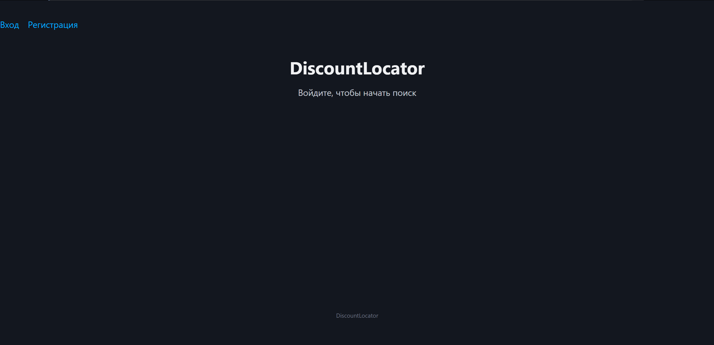
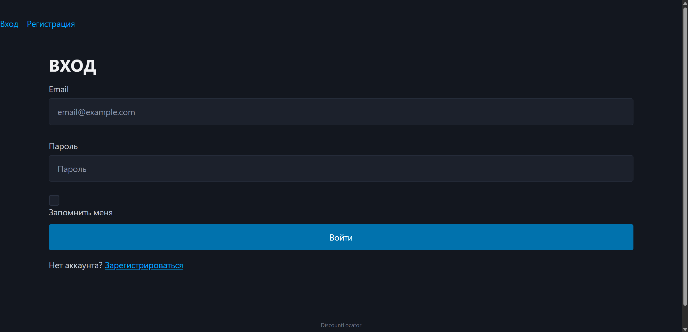
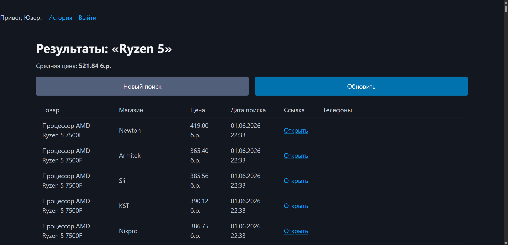
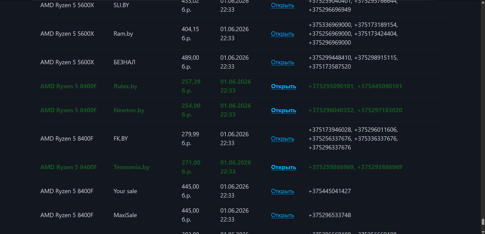
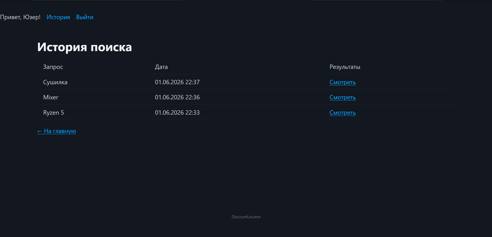

# DiscountLocator

Поисковый агрегатор предложений по беларуским магазинам (1k.by, Onliner).  
Вводите искомый товар - получаете существующие предложения.

## Стек
- Backend: Python 3.x + Flask
- База данных: MySQL + SQLAlchemy
- Авторизация: Flask-Login + Werkzeug (хеширование паролей)
- Парсинг: BeautifulSoup4 + lxml + requests
- Фронтенд:Jinja2 + Pico.css
- Фоновые задачи: threading (крона для автоочистки старых результатов)

## Скриншоты

### Главная страница (юзер не залогинен)

### Страница регистрации

### Результаты поиска

### История поиска

## Функционал

- Поиск товаров по 1k.by и Onliner
- Сравнение цен от разных продавцов
- Подсветка топ-10 самых дешёвых товаров
- Средняя цена по всем результатам
- Телефоны и ссылки на продавцов
- История поиска для каждого пользователя
- Регистрация и авторизация
- Крона для автоочистки старых результатов

## Установка и запуск

1. Склонировать репозиторий:

git clone https://github.com/An-Zab/DiscountLocator.git
cd DiscountLocator

2. Создать вирутальное окружение

python -m venv venv
venv\Scripts\activate

3. Установить библиотеки:

pip install flask flask-login flask-sqlalchemy pymysql beautifulsoup4 lxml requests

4. Создаьь БД в MySQL:

CREATE DATABASE discountlocator;

5. Создать файл secret_data.py (в корне проекта):

DB_USER = "your_user"
DB_PASSWORD = "your_password"
DB_HOST = "localhost"
DB_PORT = 3306
DB_NAME = "discountlocator"
SECRET_KEY = "your-secret-key"

6. Запустить проект:

python main.py

7. Открыть: 

http://127.0.0.1:5001

## TODO 

- Telegram-бот для уведомлений о снижении цены
- Подписки на товары (автоматический мониторинг)
- Фильтры и сортировка в результатах
- График изменения цен
- Поддержка большего числа магазинов